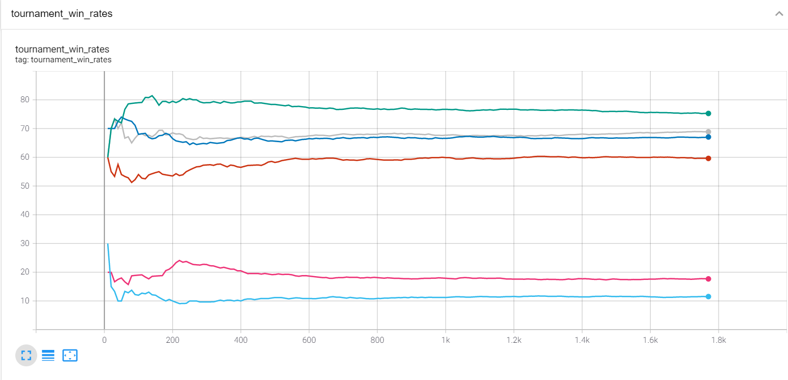
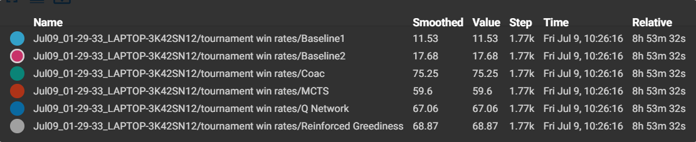

# Reinforcement Learning in Collectible Card Games
A project completed as my dissertation for my undergraduate degree at Durham University.

## About
In my last year (year 3) of my undergraduate degree at Durham University I had to complete a 'Computer Science Project' or 'Dissertation'. My project was titled "Reinfrocement Learning in Collectible Card Games". The aim of this project was to use the reinforcement learning (RL) framework to construct AI agents to play collectible card games (CCGs) and to see if they can overcome the inherent challenges associated with these games. More specifically I aimed to compare Monte-Carlo methods and some different deep reinforcement learning algorithms for Legends of Code and Magic (LOCM) - a card game specifically designed for AI research and competitions. Please feel free to read the paper associated with this project to get a deeper understanding of what exactly I did.

## Files
- **project_paper.pdf** the paper I wrote that is associated with the project (covers some of the theory and thought behind why I did what I did). 
- **agents.ipynb** jupyter notebook that contains the code for all the agents described in the paper.
- **QNetwork_training.ipynb** jupyter notebook that contains the code for the initial training of the Q-network model described in the paper.
- **QNetwork_additional_training** jupyter notebook that contains the additional self-play training of the Q-network model.
- **PolicyNetwork_training.ipynb** jupyter notebook that conatins the training of the policy network model described in the paper using the Proximal Policy Optimization algorithm (details given in the paper).

## Results
Presented below (as a tensorboard screenshot) is the results of a round robin tournament between the MCTS agent, Q-network agent, two baseline agents, and two state of the art agents (Coac and Reinforced Greediness). 

*Additional results can be found in the paper*

### Experiments
The code for much of the experiments and final validation tournaments outlined in the paper is ommited, this is because it is very similar to the code in **agents.py**. Using the code in **agents.py** I'm sure you can quickly work out how to write some code to run a round robin tournament and/or run some experiments by playing around with some of hyper-parameters.

*If you are interested in some of the specific code for some of the experiments please contact me (my personal email is given below).*

### Shoutouts
- The author's of gym-locm "OpenAI Gym Environments for Legends of Code and Magic" - Vieira, Ronaldo and Chaimowicz, Luiz and Tavares, Anderson Rocha. Some of the agent code is heavily inspired from the code found in their repo. Their reimplementation of LOCM was also vital for the success of this project. Their repo can be found here  https://github.com/ronaldosvieira/gym-locm .
- The author of "Deep-Reinforcement-Learning-Hands-On-Second-Edition" - Maxim Lapan. Much of the code for this project is inspired by the code in this book which can be found here https://github.com/PacktPublishing/Deep-Reinforcement-Learning-Hands-On-Second-Edition .

### Misc
If you would like to collaborate on this project and/or want access to the trained models mentioned in the paper then please contact me using my personal email found below.

*alex.w.goodall@gmail.com*

